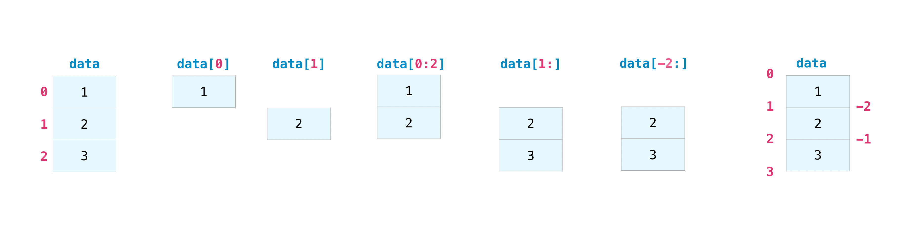

## Indexing and slicing

- You can index and slice NumPy arrays in the same ways you can slice Python lists.

### Indexing

- Indexing mean any secific position to given element are get is Indexing.

```py
data = np.array([1, 2, 3])
data[1]
data[0:2]
data[1:]
data[-2:]
```

- You can visualize This array



- In the `data[1]` meaning array index starting is 0 and this is access 1 index . In this index position values is 2.

- You can access Multi dimension array in the indexing in below EX:

```py

arr = np.array([
    [1,2,3],[4,5,6]
])

print(arr[0,2])

```

- In `a[0,2]` fist `0` is which array are you access and `2` is which element are access in the array.

- This case 0 meaning your are access this array `[1,2,3]` in second is 2 . This array `[1,2,3]` are second index value are the access. then finally 3 is return.

- You can Try the 3D and 4D array Just practice

### slicing

- Slicing in python means taking elements from one given index to another given index.

- We are pass the slicing index this `[start:end:step]`

```py

arr = np.array([1,2,3,4,5,6])

print(arr[2:4])
```

- In `arr[2:4]` Its meaning start 2 index and end 4 index. Ans : `3,4`
- Can you Ans this Quation : `a[1:5:2]` .
- Slicing support negative Index.

## Math and Statstici function

### sum

- This function is use to the sum of the array

```py
arr = np.array([1,2,4,3,3])

print(np.sum(arr))
```

### function

```py
arr = np.array([1,2,4,3,3])

print(np.abs(arr)) # Find the absolute values

print(np.log(arr)) # Natural logarithm, element-wise

print(np.average(arr)) # find the avg

print(np.mean(arr)) # find the mean values

print(np.median(arr)) # find the median values

print(np.std(arr)) # find the Standard deviation

print(np.var(arr)) # find the Compute the variance along the specified axis.

```

---

## View code file

[](https://colab.research.google.com/)
