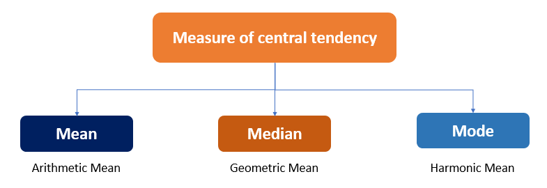

## Measures of central tendency

> Measures of central tendency are statistical tools used to identify the **central point** or typical value of a dataset.

### Type of Measures of Central tendency

1. [**Mean (Arithmetic Mean)**](#mean-arithmetic-mean).
2. [**Median**](#median).
3. [**Mode**](#mode).



***

### Practical use cases of Central Tendency

- EDA.
- Handling Missing Values.
- Feature Engineering.
- Normalization and Standardization.
- Data Distribution Analysis.

## Mean (Arithmetic mean)

### definition of mean

> The **sum of all values** divided by the **number of values**.

### Formula of mean

$$
\text{Mean} = \frac{x_1 + x_2 + \dots + x_n}{n}
$$

### Example of mean

- For the dataset ***[5, 10, 15]***, the mean is

$$
\frac{5+10+15}{3} = \frac{30}{3}=10
$$

### Advantage of mean

- Provides a single value that summarizes the entire dataset.
- Useful when all values in the dataset are equally important.

### Disadvantage of mean

- ***Sensitive to outliers:*** If the dataset contains very large or very small values (outliers), the mean can be skewed, making it an unreliable measure of central tendency for such data.

### Numpy in Mean

- **How to find mean in numpy**

```python
import numpy as np

array = np.array([1,2,3,4])

print('mean = ', np.mean(array)) # output 2.5

# other way to find mean

print('mean = ', array.mean()) # output 2.5

```

### Pandas in Mean

- **How to find mean in pandas**

```py
import pandas as pd

df = pd.DataFrame({'A': [1, 2, 3], 'B': [4, 5, 6]})

# Mean of all numeric columns
df.mean() 
```

***

***

## Median

### definition of Median

> The middle value in a dataset when the values are arranged in ascending or descending order.

### Formula of Median

#### Odd number of data points

$$
\text{Median} = \left( \frac{n + 1}{2} \right)\text{th value}
$$

#### Even number of data points

$$
\text{Median} = \frac{\left( \frac{n}{2} \text{th value} \right) + \left( \frac{n}{2} + 1 \text{th value} \right)}{2}

$$

### Example of Median

- Let's say we have the following set of numbers: 2, 5, 8, 11, 15.

To find the mean:
$$
\text{Step 1: } 2 + 5 + 8 + 11 + 15 = 41
$$
$$
\text{Step 2: } \frac{41}{5} = 8.2
$$
$$
\text{Therefore, the Mean = 8.2}
$$

### Advantage of Median

- Resistant to outliers.
- Works well for skewed distributions.
- Applicable for ordinal data.
- Clear measure of central location.
- Simple to calculate.

### Disadvantage of Median

- Ignores data distribution.
- Less informative for symmetric distributions.
- Cannot be used for further mathematical operations.
- Sensitive to sampling.
- Less stable for grouped data.

### Numpy in Median

- **How to find Median in numpy**

```python
arr = np.array([1,2,3,4,20])

print('median = ',np.median(arr)) #output 3
```

### Pandas in Median

- **How to find median in pandas**

```py
import pandas as pd

df = pd.DataFrame({'A': [1, 2, 3], 'B': [4, 5, 6]})

# median of all numeric columns
df.median() 
```

***
***

## Mode

### definition of Mode

> The mode is the value that appears most frequently in a dataset.

### Formula of Mode

- sort the give Value.
- find the most frequently number and this number is **mode**.

-

### Example of Mode

- In the dataset {1, 2, 2, 3, 4}, the mode is 2 because it appears more times than any other number.

 
### Advantage of Mode

- Simple to understand.
- Useful for categorical data.
- Not affected by outliers.
- Applicable to non-numerical data.
- Can indicate multiple modes (multimodal).
- Does not require full dataset knowledge.

### Disadvantage of Mode

- Not always unique or well-defined.
- Less stable for small datasets.
- May not represent central tendency well.
- Ignores much of the data.
- Difficult to use with continuous data.
- Not suitable for advanced analysis.

### Numpy in Mode

- **How to find meaModen in numpy**

```python
from scipy import stats
import numpy as np
arr = np.array([1,2,3,4,3,20])

print('Mode = ',stats.mode(arr)) #output 3
```

### Pandas in Mode

- **How to find Mode in pandas**

```py
import pandas as pd

series = pd.Series([1, 2, 2, 3, 3, 3, 4])
mode_value = series.mode()
print(mode_value)  # Output: 3
```

***
