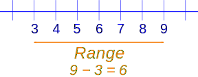
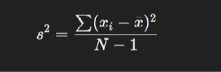
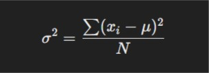
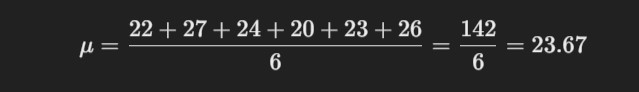
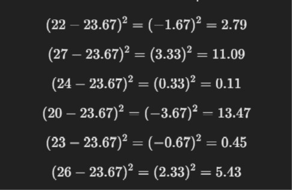
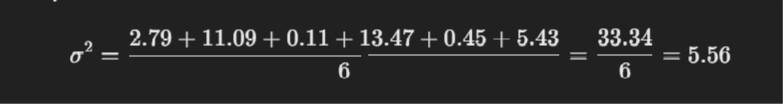
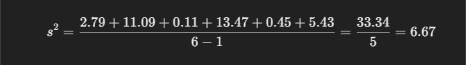
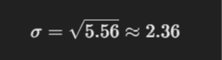
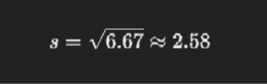

## Definition

> A measure of dispersion is a statistical measure that describes the spread or variability of a dataset. These measures help identify whether the data points are closely packed or widely spread around a central value (like the mean or median).

### Type of Measures of Variability (or Dispersion )

1. [Range](#range-arithmetic-range).
2. [Variance](#variance).
3. [Standard Deviation](#standard-deviation).
4. [Coefficient of Variation](#coefficient-of-variation).

### Practical use cases of Variability (or Dispersion )

- Assessing the spread in stock prices.
- Quality control in manufacturing.
- Risk assessment in finance (using **STD**).
- Outlier detection in data analysis.

## Range (Arithmetic Range)

### definition of Range

> Range is the difference between the **highest** and **lowest** values in a dataset.

### Formula of Range

- Range=Maximum value−Minimum value.

### Example of Range



### Advantage & Disadvantage of Range

#### Advantage of Range

- Useful for Small Data Sets.
- First Step in Identifying Outliers.
- Quick Insight into Data Spread.

#### Disadvantage of Range

- Sensitive to Outliers.
- Ignores Data Distribution.
- Provides No Information About Centrality.
- Not Robust for Large Datasets.

### Practice of Range

#### Numpy in Range

- **How to find Range in numpy**

```python
import numpy as np

data = np.array([10, 15, 20, 25, 30])

# Calculate range
range_value = np.max(data) - np.min(data)

print("Range using NumPy:", range_value)

```

#### Pandas in Mean

- **How to find Range in pandas**

```py
import pandas as pd

data = pd.DataFrame({
    'A': [10, 15, 20, 25, 30],
    'B': [35, 45, 55, 65, 75]
})

# Calculate range for each column
range_values = data.max() - data.min()
print("Range for each column using Pandas:\n", range_values)
```

***

***

## Variance

### Definition of Variance

> Variance is a statistical measurement of the spread between numbers in a data.

:::info

Variance is often depicted by this symbol: σ2.

:::

### Formula of Variance

#### Population



#### Sample



#### Where

- σ <sup>2</sup> = variance
- x <sub>i</sub> = each individual data point
- μ = mean of the data points
- N = number of data points
- x&#772; mean of the sample data points
- s <sup>2</sup> = sample variance

### Example of Variance

- Suppose we have a dataset of the ages of six people: `22,27,24,20,23,2622,27,24,20,23,26`.

1. Calculate the Mean

- The mean (μ) of the data is:



2. Subtract the Mean and Square the Result.

`For each value in the dataset, subtract the mean and then square the result.`



3. Find the Average of the Squared Differences (Variance)

- `For Population Variance`



- `For Sample Variance:`



### Advantage & Disadvantage Variance

#### Advantage of Variance

- Measures Data Spread
- Foundation for Other Metrics
- Highlights Data Variability
- Outlier Sensitivity

#### Disadvantage of Variance

- Units are Squared
- Sensitive to Outliers
- Difficult to Interpret
- Not Ideal for Non-Normal Distributions
- Complexity in Large Data

### Practice of Variance

#### Numpy in Variance

- **How to find Variance in numpy**

```python
import numpy as np

data = np.array([10, 15, 20, 25, 30])

print("Population variance :", np.var(data))
print("Sample variance :", np.var(data,ddof=1))

```

#### Pandas in Variance

- **How to find Variance in pandas**

```py
import pandas as pd

df = pd.DataFrame({
    'A': [10, 15, 20, 25, 30],
    'B': [35, 45, 55, 65, 75]
})

print("Population variance :", df.var())
print("Sample variance :", df.var(ddof=1))

```

***

***

## Standard Deviation

### Definition of Standard Deviation

> a measure of the amount of variation or dispersion in a set of data values. It indicates how much individual data points deviate, on average, from the mean (average) of the dataset.

### Formula of Standard Deviation

#### Population of SD


#### Sample of SD


#### Where of Formula

- σ <sup>2</sup> = variance
- x <sub>i</sub> = each individual data point
- μ = mean of the data points
- N = number of data points
- x&#772; mean of the sample data points
- s <sup>2</sup> = sample variance

### Example of Standard Deviation

- Let's calculate the standard deviation for the dataset representing the ages of six people: `22,27,24,20,23,26`.

1. Calculate the Mean

- The mean (μ) of the data is:


2. Subtract the Mean and Square the Result.
`For each value in the dataset, subtract the mean and then square the result.`


3. Find the Average of the Squared Differences (Variance)

- `For Population Variance`


- `For Sample Variance:`


4. Take the Square Root to Get Standard Deviation

    1. For Population Standard Deviation (𝜎):
    

    2. For Sample Standard Deviation (𝜎):
    

Than Population Standard Deviation is `2.36` and Sample Standard Deviation is `2.58`.

### Practice of Standard Deviation

#### Numpy in Standard Deviation

- **How to find Standard Deviation in numpy**

```python
import numpy as np

data = np.array([10, 15, 20, 25, 30])

print("Population Standard Deviation :", np.std(data))
print("Sample Standard Deviation :", np.std(data,ddof=1))

```

#### Pandas in Standard Deviation

- **How to find Standard Deviation in pandas**

```py
import pandas as pd

df = pd.DataFrame({
    'A': [10, 15, 20, 25, 30],
    'B': [35, 45, 55, 65, 75]
})

print("Population Standard Deviation :", df.std())
print("Sample Standard Deviation :", df.std(ddof=1))

```

***

***

## Coefficient of Variation

### Definition of Coefficient of Variation

> Coefficient of Variation (CV) is a statistical measure that represents the ratio of the standard deviation to the mean. It expresses the extent of variability in relation to the mean of the dataset, allowing for comparison of relative variability between different datasets, regardless of their units or scales.

### Formula of Coefficient of Variation


#### Where of Formula

- σ = population standard deviation
- μ = population mean

### Example of Coefficient of Variation

- Let's calculate the standard deviation for the dataset representing the ages of six people: `22,27,24,20,23,26`

- In before i have calculate standard deviation and Mean.`Standard deviation = 2.6` and `mean = 5.6`.

- ans : `Standard deviation = 2.6  / mean = 5.6  = 0.46`.

### Practice of Coefficient of Variation

#### Numpy in Coefficient of Variation

- **How to find Coefficient of Variation in numpy**

```python
import numpy as np

data = np.array([10, 15, 20, 25, 30])

ans_population = np.std(data) / np.mean(data)
ans_Sample = np.std(data,ddof=1) / np.mean(data)

print("population Coefficient of Variation :", ans )
print("Sample Coefficient of Variation :", ans_Sample)

```

#### Pandas in Coefficient of Variation

- **How to find Coefficient of Variation in pandas**

```py
import pandas as pd

df = pd.DataFrame({
    'A': [10, 15, 20, 25, 30],
    'B': [35, 45, 55, 65, 75]
})

cv = lambda x: np.std(x, ddof=1) / np.mean(x) 

print(df.apply(cv))

```

***

