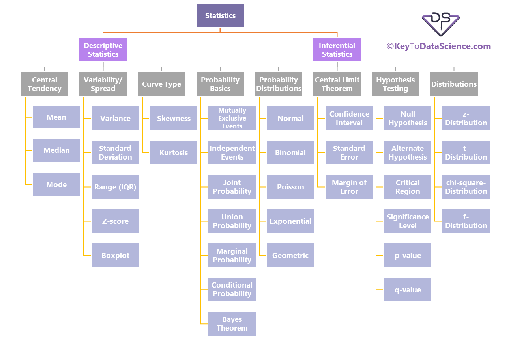
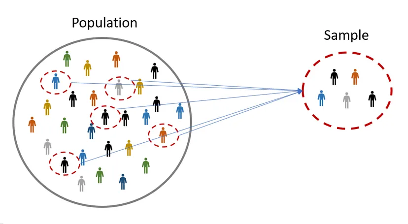
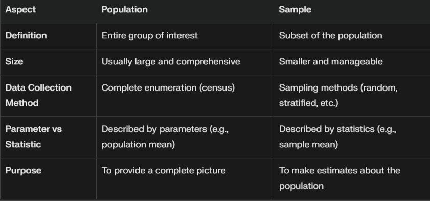
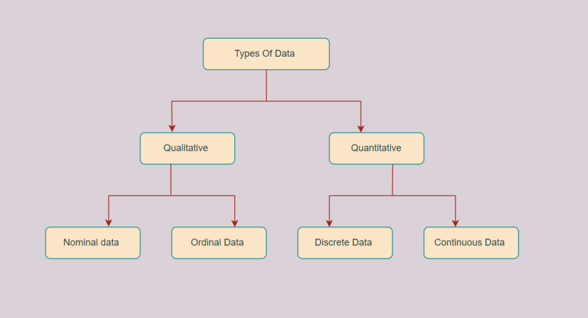
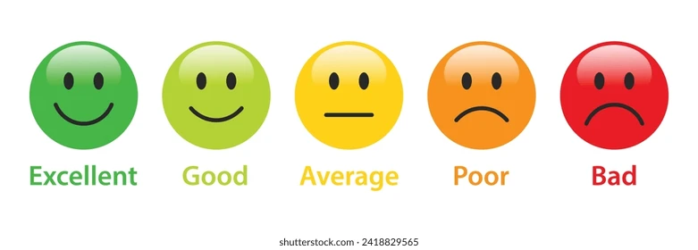

## Statistics

- Statistics is a branch of mathematics that involves collecting,analysing, interpreting, and presenting data. It provides tools and    Methods to understand and make sense of large amounts of data and to draw conclusions and make decisions based on the data .

- In practice, statistics is used in a wide range of fields, such as business, economics, social sciences, medicine, and engineering. It is used to conduct research studies, analyse market trends, evaluate the effectiveness of treatments and interventions, and make forecasts and predictions .

### Examples

1. **Business** -> Data Analysis (Identifying customer behavior) andDemand Forecasting.
2. **Medical** -> Identify efficacy of new medicines(Clinical trials), Identifying risk factor for diseases(Epidemiology).
3. **Government & Politics** -> Conducting surveys, Polling.
4. **Environmental Science** -> Climate research.
5. **Cricket** -> Show the chart and batman performers.

***

## Types of Statistics

1. Descriptive Statistics
2. Inferential Statistics

### Descriptive Statistics

> Descriptive statistics are techniques used to summarize and describe the main features of a dataset.

- Descriptive statistics provide simple summaries and measures about a dataset, either representing an entire population or a sample from it.
- They give insight into the central tendency, spread, and overall shape of the data, making complex data easier to understand and interpret. Below are the key components of descriptive statistics, explained in detail.

#### Type of Descriptive Statistics

1. Measures of Central Tendency
2. Measures of Dispersion (Spread)
3. Measures of Shape
4. Percentiles and Quartiles
5. Data Visualization in Descriptive Statistics

### Inferential Statistics

> ***Inferential statistics*** is a branch of statistics that allows researchers to make inferences or generalizations about a larger population based on data collected from a sample.

- Inferential statistics go beyond describing data. Instead of just summarizing the data you have (as in descriptive statistics), inferential statistics allow you to make predictions or inferences about a larger population based on a sample of data.
- This involves estimating population parameters, testing hypotheses, and making predictions, using techniques that consider uncertainty and randomness.

#### Type of Inferential Statistics

1. Probability Basics
2. Probability Distributions
3. Central Limit Theorem
4. Hypothesis Testing
5. Distributions

***

## Population and Sample

### Population

- A population refers to the entire set of individuals, objects, or data points that you want to study.
- This can include **everyone** or **everything** within a **specific group**, such as all students in a school or all residents of a country.
- Population Dataset is lerge dataset.
- **Example**  Imagine there are 10,000 students enrolled at a university, and you want to know the average height of all students.In all Students are the Population .

### Sample

- A sample is a subset of the population selected for analysis.
- Sample Dataset is **Smaller** dataset.
- **Example**  Imagine there are 10,000 students enrolled at a university, and you want to know the average height of all students.In Only specifically Group Data are use is the Sample .

### Key Differences of Population v/s Sample

***

## Types of Data

1. Qualitative Data (Categorical Data)
    1. Norminal Data
    2. Ordinal Data
2. Quantitative Data (Numerical Data)
    1. Discrete Data
    2. Continuos Data

### Qualitative Data (Categorical Data)

> Qualitative data represents categories or characteristics that cannot be quantified numerically.

#### Nominal Data

- Data that names or labels variables without any quantitative value or order.
- Inherent order or ranking doesn't matter.
- Ex Eye color, Gender

#### Ordinal Data

- Data with categories that have a meaningful order or rank, but the differences between ranks are not quantifiable.
- Order are the matter.
- Education level (High school, Bachelor's, Master's, PhD),Customer satisfaction ratings (Poor, Fair, Good, Excellent).

### Quantitative Data (Numerical Data)

> Quantitative data represents numeric values and quantifies variables. It measures amounts, quantities, or sizes.

#### Discrete Data

- Data that consists of distinct or separate values, often counted in whole numbers.
- Ex Number of students in a class (15, 20, 35),

#### Continuous Data

- Data that can take any value within a given range, often resulting from measurements.
- Height of students (170.5 cm, 162.8 cm),

***
